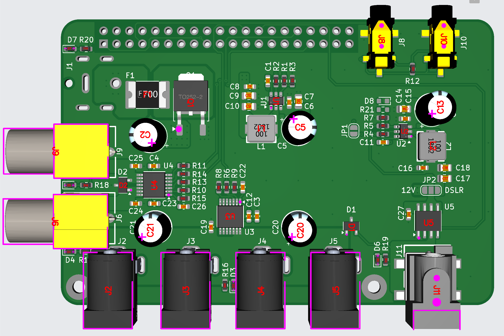

# Raspberry Pi HAT Power Shield

## Overview
The Raspberry Pi HAT Power Shield is a custom power distribution board designed to interface with the Raspberry Pi. It provides multiple 12V power outputs, PWM-controlled heating outputs, and temperature monitoring through DS18B20 sensors.



## Features
- **5 x 12V Outputs** (Total limit: 10A)
- **1 x 12V or 8V Output** (Limit: 2A)
- **2 x 12V PWM Outputs** (Limit: 3.5A each, 8kHz PWM frequency)
- **2 x DS18B20 Temperature Probes**
- **INDI compatibility** for remote control via INDI clients
- **GPIO control** via `pigpiod` for low-level hardware management

## Hardware Requirements
- Raspberry Pi (Any model with GPIO support)
- Custom Raspberry Pi HAT Power Shield
- Power supply capable of providing required current
- DS18B20 temperature sensors (optional, for temperature monitoring)

## Software Requirements

This project requires the following software packages:

### System Packages
Install the required system packages using the following command:
```bash
sudo apt update && sudo apt install -y indi-bin libindi-dev pigpio gpiod
```

### GPIO Control
This project uses **`pigpiod`** for controlling GPIOs. Ensure pigpiod is running in order to use this driver.

To ensure `pigpiod` starts automatically on boot, create a systemd service file:

1. Create and open the service file:
   ```bash
   sudo nano /etc/systemd/system/pigpiod.service
   ```
   There is a [template](./pigpiod.service.dist) provided in this repo.

2. Add the following content:
   ```ini
   [Unit]
   Description=Pigpio daemon
   After=network.target

   [Service]
   Type=forking
   ExecStart=/usr/bin/pigpiod
   ExecStop=/bin/systemctl kill pigpiod
   Restart=always
   User=root
   PIDFile=/var/run/pigpio.pid

   [Install]
   WantedBy=multi-user.target
   ```
3. Save and exit the file.
4. Reload the systemd daemon:
   ```bash
   sudo systemctl daemon-reload
   ```
5. Enable and start the service:
   ```bash
   sudo systemctl enable pigpiod
   sudo systemctl start pigpiod
   ```

### Enabling 1-Wire Protocol for DS18B20 Sensors
To use DS18B20 temperature sensors, enable the 1-wire protocol on the Raspberry Pi by using raspi-config or manually enabling it.

To enable 1-wire manually:

1. Edit the boot configuration file:
   ```bash
   sudo nano /boot/config.txt
   ```
2. Add the following line at the end of the file:
   ```bash
   dtoverlay=w1-gpio
   ```
3. Save the file and reboot:
   ```bash
   sudo reboot
   ```
4. After rebooting, verify that the temperature sensors are detected:
   ```bash
   ls /sys/bus/w1/devices/
   ```
   You should see directories with names starting with `28-`, which correspond to the DS18B20 sensors.

## Building and Running
### Cloning the Repository
```bash
git clone <repository-url>
cd <repository-name>
```

### Building the Project
```bash
mkdir build
cd build
cmake ..
make
sudo make install
```

### Running the INDI Driver
```bash
indiserver indi_rpi_pb
```

## Usage
Once the INDI driver is running, you can connect to it using any INDI-compatible client, such as KStars or Ekos, and control the power outputs, heaters, and temperature probes.

## License
This project is licensed under the MIT License.

## Contributing
Contributions are welcome! Feel free to open an issue or submit a pull request.

